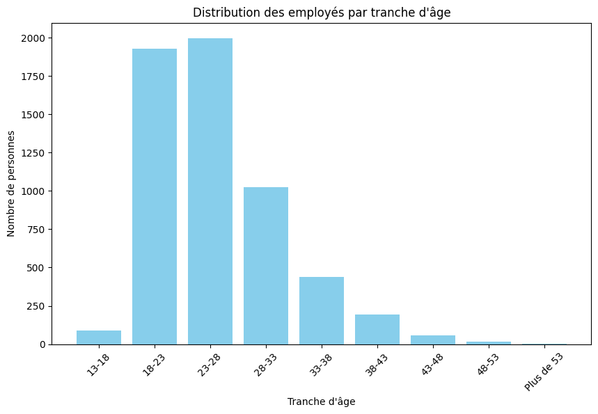
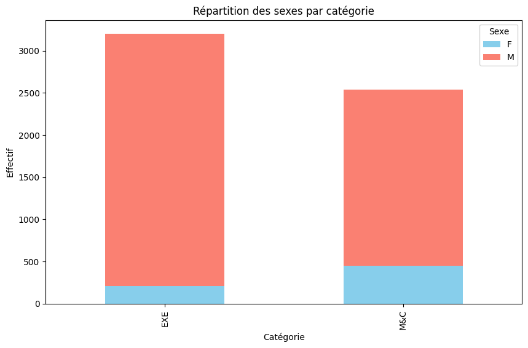
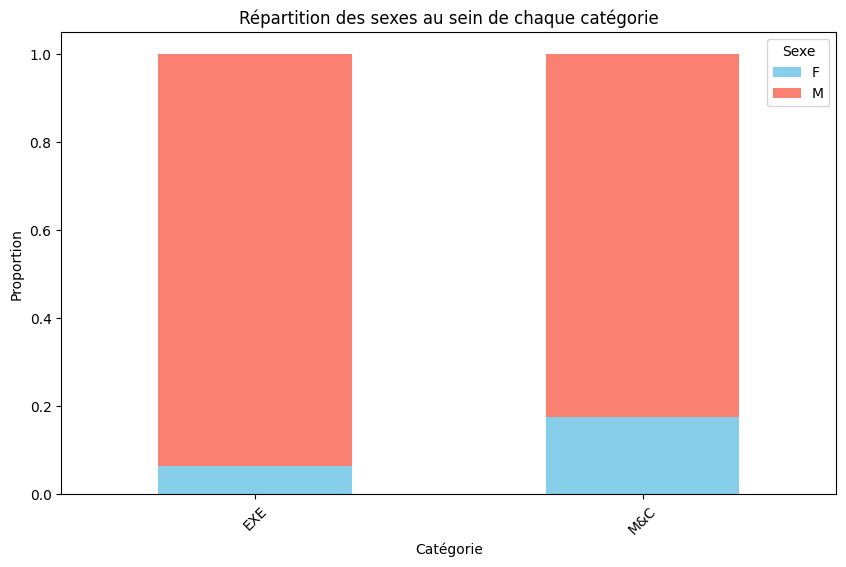
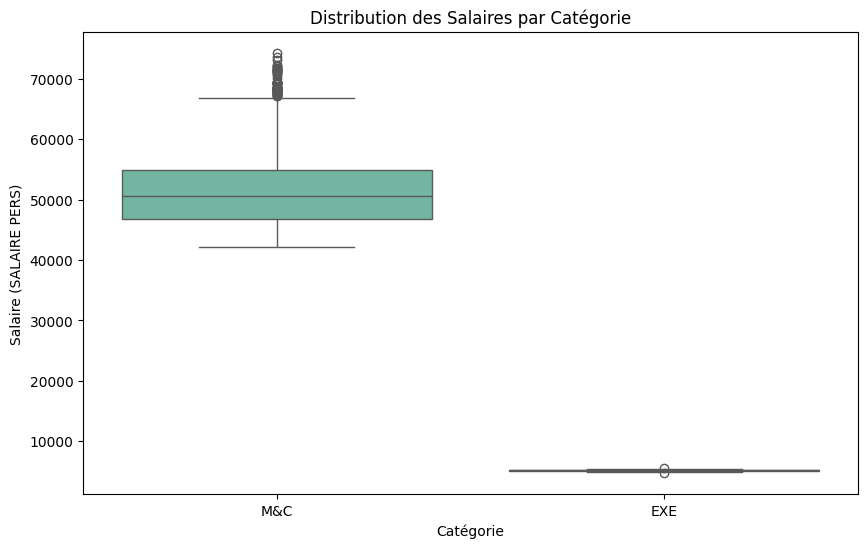
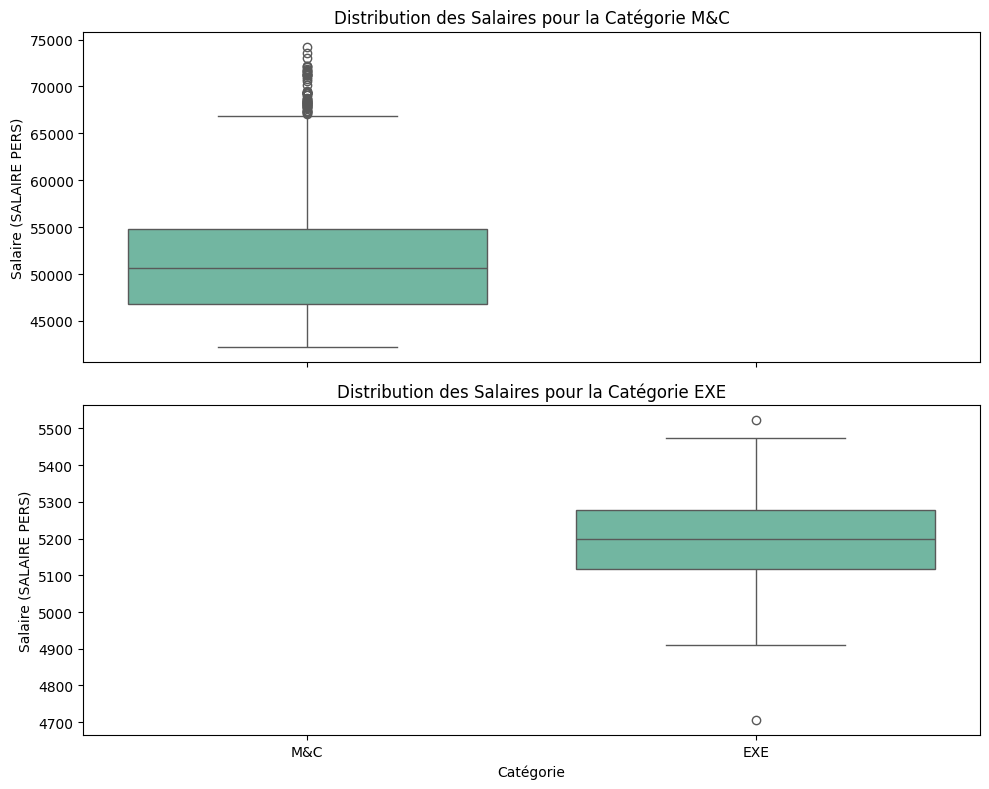

---
output:
  word_document: default
  html_document: default
---
### Analyse (TRAVAIL PRATIQUE DU COURS DE DATAMINING)
---

### Libraries

#### Installation


```python
# %pip install pandas
# %pip install --upgrade pip
# %pip install polars
# %pip install matplotlib plotly
# %pip install fastexcel
# %pip install pyarrow
# %pip install openpyxl
# %pip install seaborn
# %pip install scikit-learn
# %pip install statsmodels
```

#### Importation des librairies


```python
import pandas as pd # type: ignore
import polars as pl
import matplotlib.pyplot as plt
import seaborn as sns
from sklearn.model_selection import train_test_split
from sklearn.linear_model import LogisticRegression
from sklearn.metrics import accuracy_score, classification_report
from sklearn.preprocessing import LabelEncoder
import statsmodels.api as sm
from statsmodels.stats.outliers_influence import variance_inflation_factor
```

#### Data Cleaning & Preprocessing
---


```python
data_pl = pl.read_excel("data.xlsx") # with Polars
data_pd = pd.read_excel("data.xlsx") # With Pandas
ctx = pl.SQLContext(data=data_pl, eager=True) # For SQL
```


```python
print(data_pl)
```

    shape: (5_744, 19)
    ┌───────────┬───────┬──────────────┬──────────────┬───┬─────────┬──────────┬───────────┬────────┐
    │ CATEGORIE ┆ GRADE ┆ DERNIER      ┆ SALAIRE PERS ┆ … ┆ ENERGIE ┆ IFT      ┆ IDP       ┆ IPM    │
    │ ---       ┆ ---   ┆ AVACEMENT EN ┆ ---          ┆   ┆ ---     ┆ ---      ┆ ---       ┆ ---    │
    │ str       ┆ str   ┆ GRADE        ┆ f64          ┆   ┆ i64     ┆ f64      ┆ f64       ┆ i64    │
    │           ┆       ┆ ---          ┆              ┆   ┆         ┆          ┆           ┆        │
    │           ┆       ┆ date         ┆              ┆   ┆         ┆          ┆           ┆        │
    ╞═══════════╪═══════╪══════════════╪══════════════╪═══╪═════════╪══════════╪═══════════╪════════╡
    │ M&C       ┆ 11    ┆ 1998-07-01   ┆ 47865.44225  ┆ … ┆ 12045   ┆ 97837.51 ┆ 126115.18 ┆ 348500 │
    │ M&C       ┆ 11    ┆ 1998-09-01   ┆ 47652.18334  ┆ … ┆ 12045   ┆ 97837.51 ┆ 126115.18 ┆ 348500 │
    │ M&C       ┆ 11    ┆ 2000-08-01   ┆ 47348.71096  ┆ … ┆ 12045   ┆ 97837.51 ┆ 126115.18 ┆ 348500 │
    │ M&C       ┆ 11    ┆ 2000-10-01   ┆ 47115.68266  ┆ … ┆ 12045   ┆ 97837.51 ┆ 126115.18 ┆ 348500 │
    │ M&C       ┆ 11    ┆ 2000-12-01   ┆ 47344.56758  ┆ … ┆ 12045   ┆ 97837.51 ┆ 126115.18 ┆ 348500 │
    │ …         ┆ …     ┆ …            ┆ …            ┆ … ┆ …       ┆ …        ┆ …         ┆ …      │
    │ EXE       ┆ 71    ┆ 2023-11-01   ┆ 4920.44077   ┆ … ┆ 5940    ┆ 67568.84 ┆ 46635.93  ┆ 342500 │
    │ EXE       ┆ 71    ┆ 2023-11-01   ┆ 4920.44077   ┆ … ┆ 5940    ┆ 67568.84 ┆ 46635.93  ┆ 342500 │
    │ EXE       ┆ 71    ┆ 2023-11-01   ┆ 4920.44077   ┆ … ┆ 5940    ┆ 67568.84 ┆ 46635.93  ┆ 342500 │
    │ EXE       ┆ 61    ┆ 2023-11-01   ┆ 4913.62077   ┆ … ┆ 5940    ┆ 67278.84 ┆ 46413.51  ┆ 342500 │
    │ EXE       ┆ 61    ┆ 2023-11-01   ┆ 4913.62077   ┆ … ┆ 5940    ┆ 67278.84 ┆ 46413.51  ┆ 342500 │
    └───────────┴───────┴──────────────┴──────────────┴───┴─────────┴──────────┴───────────┴────────┘
    


```python
data_pd.info()
```

    <class 'pandas.core.frame.DataFrame'>
    RangeIndex: 5744 entries, 0 to 5743
    Data columns (total 19 columns):
     #   Column                      Non-Null Count  Dtype         
    ---  ------                      --------------  -----         
     0   CATEGORIE                   5744 non-null   object        
     1   GRADE                       5744 non-null   int64         
     2   DERNIER AVACEMENT EN GRADE  5742 non-null   datetime64[ns]
     3   SALAIRE PERS                5744 non-null   float64       
     4   CITE                        5744 non-null   object        
     5   SEXE                        5744 non-null   object        
     6   ETATCIVIL                   5678 non-null   object        
     7   INDEPOUSE                   5534 non-null   float64       
     8   ENFANT                      5744 non-null   int64         
     9   COTATION                    2536 non-null   float64       
     10  DATENAISSA                  5744 non-null   datetime64[ns]
     11  DATEENGAGE                  5744 non-null   datetime64[ns]
     12  TRP                         5744 non-null   float64       
     13  LGT                         5744 non-null   float64       
     14  SSANTE                      5744 non-null   float64       
     15  ENERGIE                     5744 non-null   int64         
     16  IFT                         5744 non-null   float64       
     17  IDP                         5744 non-null   float64       
     18  IPM                         5744 non-null   int64         
    dtypes: datetime64[ns](3), float64(8), int64(4), object(4)
    memory usage: 852.8+ KB
    


```python
ctx.execute("SELECT * FROM data LIMIT 6")
```


<div><style>
.dataframe > thead > tr,
.dataframe > tbody > tr {
  text-align: right;
  white-space: pre-wrap;
}
</style>
<small>shape: (6, 19)</small><table border="1" class="dataframe"><thead><tr><th>CATEGORIE</th><th>GRADE</th><th>DERNIER AVACEMENT EN GRADE</th><th>SALAIRE PERS</th><th>CITE</th><th>SEXE</th><th>ETATCIVIL</th><th>INDEPOUSE</th><th>ENFANT</th><th>COTATION</th><th>DATENAISSA</th><th>DATEENGAGE</th><th>TRP</th><th>LGT</th><th>SSANTE</th><th>ENERGIE</th><th>IFT</th><th>IDP</th><th>IPM</th></tr><tr><td>str</td><td>str</td><td>date</td><td>f64</td><td>str</td><td>str</td><td>str</td><td>str</td><td>i64</td><td>str</td><td>date</td><td>date</td><td>f64</td><td>f64</td><td>f64</td><td>i64</td><td>f64</td><td>f64</td><td>i64</td></tr></thead><tbody><tr><td>&quot;M&amp;C&quot;</td><td>&quot;11&quot;</td><td>1998-07-01</td><td>47865.44225</td><td>&quot;06&quot;</td><td>&quot;M&quot;</td><td>&quot;4&quot;</td><td>&quot;1&quot;</td><td>0</td><td>&quot;64&quot;</td><td>1950-06-02</td><td>1968-09-01</td><td>124800.0</td><td>91627.03</td><td>270515.44</td><td>12045</td><td>97837.51</td><td>126115.18</td><td>348500</td></tr><tr><td>&quot;M&amp;C&quot;</td><td>&quot;11&quot;</td><td>1998-09-01</td><td>47652.18334</td><td>&quot;05&quot;</td><td>&quot;M&quot;</td><td>&quot;0&quot;</td><td>&quot;0&quot;</td><td>0</td><td>&quot;68&quot;</td><td>1954-01-01</td><td>1980-04-14</td><td>124800.0</td><td>91627.03</td><td>270515.44</td><td>12045</td><td>97837.51</td><td>126115.18</td><td>348500</td></tr><tr><td>&quot;M&amp;C&quot;</td><td>&quot;11&quot;</td><td>2000-08-01</td><td>47348.71096</td><td>&quot;06&quot;</td><td>&quot;M&quot;</td><td>&quot;4&quot;</td><td>&quot;1&quot;</td><td>0</td><td>&quot;67&quot;</td><td>1960-02-02</td><td>1987-12-14</td><td>124800.0</td><td>91627.03</td><td>270515.44</td><td>12045</td><td>97837.51</td><td>126115.18</td><td>348500</td></tr><tr><td>&quot;M&amp;C&quot;</td><td>&quot;11&quot;</td><td>2000-10-01</td><td>47115.68266</td><td>&quot;01&quot;</td><td>&quot;M&quot;</td><td>&quot;4&quot;</td><td>&quot;1&quot;</td><td>0</td><td>&quot;63&quot;</td><td>1953-01-15</td><td>1977-08-15</td><td>124800.0</td><td>91627.03</td><td>270515.44</td><td>12045</td><td>97837.51</td><td>126115.18</td><td>348500</td></tr><tr><td>&quot;M&amp;C&quot;</td><td>&quot;11&quot;</td><td>2000-12-01</td><td>47344.56758</td><td>&quot;02&quot;</td><td>&quot;M&quot;</td><td>&quot;4&quot;</td><td>&quot;1&quot;</td><td>1</td><td>&quot;65&quot;</td><td>1963-05-24</td><td>1987-12-14</td><td>124800.0</td><td>91627.03</td><td>270515.44</td><td>12045</td><td>97837.51</td><td>126115.18</td><td>348500</td></tr><tr><td>&quot;M&amp;C&quot;</td><td>&quot;11&quot;</td><td>2001-07-01</td><td>47141.68761</td><td>&quot;06&quot;</td><td>&quot;M&quot;</td><td>&quot;4&quot;</td><td>&quot;1&quot;</td><td>0</td><td>&quot;64&quot;</td><td>1950-01-08</td><td>1980-08-11</td><td>124800.0</td><td>91627.03</td><td>270515.44</td><td>12045</td><td>97837.51</td><td>126115.18</td><td>348500</td></tr></tbody></table></div>


```python
result = data_pl.select(
    pl.col('DATENAISSA'),
    pl.col('DATEENGAGE'),
    ((pl.col("DATEENGAGE") - pl.col('DATENAISSA')).cast(pl.Duration) / pl.duration(days=365.25)).cast(pl.Int32).alias("Age à l'engagement")
)

# Afficher le résultat
print(result)
```

    shape: (5_744, 3)
    ┌────────────┬────────────┬────────────────────┐
    │ DATENAISSA ┆ DATEENGAGE ┆ Age à l'engagement │
    │ ---        ┆ ---        ┆ ---                │
    │ date       ┆ date       ┆ i32                │
    ╞════════════╪════════════╪════════════════════╡
    │ 1950-06-02 ┆ 1968-09-01 ┆ 18                 │
    │ 1954-01-01 ┆ 1980-04-14 ┆ 26                 │
    │ 1960-02-02 ┆ 1987-12-14 ┆ 27                 │
    │ 1953-01-15 ┆ 1977-08-15 ┆ 24                 │
    │ 1963-05-24 ┆ 1987-12-14 ┆ 24                 │
    │ …          ┆ …          ┆ …                  │
    │ 1990-05-15 ┆ 2023-11-01 ┆ 33                 │
    │ 2000-05-05 ┆ 2023-11-01 ┆ 23                 │
    │ 1997-04-12 ┆ 2023-11-01 ┆ 26                 │
    │ 1988-02-06 ┆ 2023-11-01 ┆ 35                 │
    │ 1991-04-18 ┆ 2023-11-01 ┆ 32                 │
    └────────────┴────────────┴────────────────────┘
    

#### Création des nouvelles variables

Sur base des données existantes, nous pouvons créer deux nouvelles colonnes :
1. **Age à l'engagement** : Différence entre l'année d'engagement et l'année de naissance
2. **Tranche d'âge**
    


```python
data_pl_new = data_pl.with_columns(
    age_engagement = ((pl.col("DATEENGAGE") - pl.col('DATENAISSA')).cast(pl.Duration) / pl.duration(days=365.25)).cast(pl.Int32).alias("Age à l'engagement")
)
```


```python
print(data_pl_new)
```

    shape: (5_744, 20)
    ┌───────────┬───────┬──────────────┬─────────────┬───┬──────────┬───────────┬────────┬─────────────┐
    │ CATEGORIE ┆ GRADE ┆ DERNIER      ┆ SALAIRE     ┆ … ┆ IFT      ┆ IDP       ┆ IPM    ┆ age_engagem │
    │ ---       ┆ ---   ┆ AVACEMENT EN ┆ PERS        ┆   ┆ ---      ┆ ---       ┆ ---    ┆ ent         │
    │ str       ┆ str   ┆ GRADE        ┆ ---         ┆   ┆ f64      ┆ f64       ┆ i64    ┆ ---         │
    │           ┆       ┆ ---          ┆ f64         ┆   ┆          ┆           ┆        ┆ i32         │
    │           ┆       ┆ date         ┆             ┆   ┆          ┆           ┆        ┆             │
    ╞═══════════╪═══════╪══════════════╪═════════════╪═══╪══════════╪═══════════╪════════╪═════════════╡
    │ M&C       ┆ 11    ┆ 1998-07-01   ┆ 47865.44225 ┆ … ┆ 97837.51 ┆ 126115.18 ┆ 348500 ┆ 18          │
    │ M&C       ┆ 11    ┆ 1998-09-01   ┆ 47652.18334 ┆ … ┆ 97837.51 ┆ 126115.18 ┆ 348500 ┆ 26          │
    │ M&C       ┆ 11    ┆ 2000-08-01   ┆ 47348.71096 ┆ … ┆ 97837.51 ┆ 126115.18 ┆ 348500 ┆ 27          │
    │ M&C       ┆ 11    ┆ 2000-10-01   ┆ 47115.68266 ┆ … ┆ 97837.51 ┆ 126115.18 ┆ 348500 ┆ 24          │
    │ M&C       ┆ 11    ┆ 2000-12-01   ┆ 47344.56758 ┆ … ┆ 97837.51 ┆ 126115.18 ┆ 348500 ┆ 24          │
    │ …         ┆ …     ┆ …            ┆ …           ┆ … ┆ …        ┆ …         ┆ …      ┆ …           │
    │ EXE       ┆ 71    ┆ 2023-11-01   ┆ 4920.44077  ┆ … ┆ 67568.84 ┆ 46635.93  ┆ 342500 ┆ 33          │
    │ EXE       ┆ 71    ┆ 2023-11-01   ┆ 4920.44077  ┆ … ┆ 67568.84 ┆ 46635.93  ┆ 342500 ┆ 23          │
    │ EXE       ┆ 71    ┆ 2023-11-01   ┆ 4920.44077  ┆ … ┆ 67568.84 ┆ 46635.93  ┆ 342500 ┆ 26          │
    │ EXE       ┆ 61    ┆ 2023-11-01   ┆ 4913.62077  ┆ … ┆ 67278.84 ┆ 46413.51  ┆ 342500 ┆ 35          │
    │ EXE       ┆ 61    ┆ 2023-11-01   ┆ 4913.62077  ┆ … ┆ 67278.84 ┆ 46413.51  ┆ 342500 ┆ 32          │
    └───────────┴───────┴──────────────┴─────────────┴───┴──────────┴───────────┴────────┴─────────────┘
    

##### Création de la tranche d'âge


```python
# Conversion du format polars vers Pandas
data_pd = data_pl_new.to_pandas()

bins = [13, 18, 23, 28, 33, 38, 43, 48, 53, 56]
labels = ['13-18', '18-23', '23-28', '28-33', '33-38', '38-43', '43-48', '48-53', 'Plus de 53']

# Ajouter une nouvelle colonne pour la tranche d'âge, en utilisant pd.cut()
data_pd['tranche_age_engagement'] = pd.cut(data_pd['age_engagement'], bins=bins, labels=labels, right=False)

print(data_pd[['age_engagement', 'tranche_age_engagement']])
```

          age_engagement tranche_age_engagement
    0                 18                  18-23
    1                 26                  23-28
    2                 27                  23-28
    3                 24                  23-28
    4                 24                  23-28
    ...              ...                    ...
    5739              33                  33-38
    5740              23                  23-28
    5741              26                  23-28
    5742              35                  33-38
    5743              32                  28-33
    
    [5744 rows x 2 columns]
    


```python
# Conversion de Pandas en Polars
data_pl_new = pl.DataFrame(data_pd)
```


```python
print(data_pl_new)
```

    shape: (5_744, 21)
    ┌───────────┬───────┬─────────────┬─────────────┬───┬───────────┬────────┬────────────┬────────────┐
    │ CATEGORIE ┆ GRADE ┆ DERNIER     ┆ SALAIRE     ┆ … ┆ IDP       ┆ IPM    ┆ age_engage ┆ tranche_ag │
    │ ---       ┆ ---   ┆ AVACEMENT   ┆ PERS        ┆   ┆ ---       ┆ ---    ┆ ment       ┆ e_engageme │
    │ str       ┆ str   ┆ EN GRADE    ┆ ---         ┆   ┆ f64       ┆ i64    ┆ ---        ┆ nt         │
    │           ┆       ┆ ---         ┆ f64         ┆   ┆           ┆        ┆ i32        ┆ ---        │
    │           ┆       ┆ datetime[ms ┆             ┆   ┆           ┆        ┆            ┆ cat        │
    │           ┆       ┆ ]           ┆             ┆   ┆           ┆        ┆            ┆            │
    ╞═══════════╪═══════╪═════════════╪═════════════╪═══╪═══════════╪════════╪════════════╪════════════╡
    │ M&C       ┆ 11    ┆ 1998-07-01  ┆ 47865.44225 ┆ … ┆ 126115.18 ┆ 348500 ┆ 18         ┆ 18-23      │
    │           ┆       ┆ 00:00:00    ┆             ┆   ┆           ┆        ┆            ┆            │
    │ M&C       ┆ 11    ┆ 1998-09-01  ┆ 47652.18334 ┆ … ┆ 126115.18 ┆ 348500 ┆ 26         ┆ 23-28      │
    │           ┆       ┆ 00:00:00    ┆             ┆   ┆           ┆        ┆            ┆            │
    │ M&C       ┆ 11    ┆ 2000-08-01  ┆ 47348.71096 ┆ … ┆ 126115.18 ┆ 348500 ┆ 27         ┆ 23-28      │
    │           ┆       ┆ 00:00:00    ┆             ┆   ┆           ┆        ┆            ┆            │
    │ M&C       ┆ 11    ┆ 2000-10-01  ┆ 47115.68266 ┆ … ┆ 126115.18 ┆ 348500 ┆ 24         ┆ 23-28      │
    │           ┆       ┆ 00:00:00    ┆             ┆   ┆           ┆        ┆            ┆            │
    │ M&C       ┆ 11    ┆ 2000-12-01  ┆ 47344.56758 ┆ … ┆ 126115.18 ┆ 348500 ┆ 24         ┆ 23-28      │
    │           ┆       ┆ 00:00:00    ┆             ┆   ┆           ┆        ┆            ┆            │
    │ …         ┆ …     ┆ …           ┆ …           ┆ … ┆ …         ┆ …      ┆ …          ┆ …          │
    │ EXE       ┆ 71    ┆ 2023-11-01  ┆ 4920.44077  ┆ … ┆ 46635.93  ┆ 342500 ┆ 33         ┆ 33-38      │
    │           ┆       ┆ 00:00:00    ┆             ┆   ┆           ┆        ┆            ┆            │
    │ EXE       ┆ 71    ┆ 2023-11-01  ┆ 4920.44077  ┆ … ┆ 46635.93  ┆ 342500 ┆ 23         ┆ 23-28      │
    │           ┆       ┆ 00:00:00    ┆             ┆   ┆           ┆        ┆            ┆            │
    │ EXE       ┆ 71    ┆ 2023-11-01  ┆ 4920.44077  ┆ … ┆ 46635.93  ┆ 342500 ┆ 26         ┆ 23-28      │
    │           ┆       ┆ 00:00:00    ┆             ┆   ┆           ┆        ┆            ┆            │
    │ EXE       ┆ 61    ┆ 2023-11-01  ┆ 4913.62077  ┆ … ┆ 46413.51  ┆ 342500 ┆ 35         ┆ 33-38      │
    │           ┆       ┆ 00:00:00    ┆             ┆   ┆           ┆        ┆            ┆            │
    │ EXE       ┆ 61    ┆ 2023-11-01  ┆ 4913.62077  ┆ … ┆ 46413.51  ┆ 342500 ┆ 32         ┆ 28-33      │
    │           ┆       ┆ 00:00:00    ┆             ┆   ┆           ┆        ┆            ┆            │
    └───────────┴───────┴─────────────┴─────────────┴───┴───────────┴────────┴────────────┴────────────┘
    

### Analyse de données
---

#### Explication des variables

- **CATEGORIE** : Code ou description de la catégorie professionnelle du personnel 
- **GRADE** : Niveau de grade de l'employé au sein de la catégorie
- **DERNIER AVACEMENT EN GRADE** : Date du dernier avancement en grade de l'employé.
- **SALAIRE PERS** : Salaire personnel ou de base de l'employé,
- **CITE** : Code de la cité ou de la localité où réside l'employé
- **SEXE** : Sexe de l'employé 
- **ETATCIVIL** : Code de l'état civil de l'employé.
- **INDEPOUSE** : Indicateur pour savoir si l'employé a un conjoint à charge. Par exemple, "1" pour oui et "0" pour non.
- **ENFANT** : Nombre d'enfants à charge de l'employé
- **COTATION** : Code de cotation ou score lié au poste ou à la performance de l'employé.
- **DATENAISSA** : Date de naissance de l'employé.
- **DATEENGAGE** : Date d'engagement de l'employé dans l'entreprise (date d'embauche).
- **TRP** : Indemnité de transport, ou allocation liée aux frais de déplacement.
- **LGT** : Allocation logement de l'employé.
- **SSANTE** : Cotisation ou indemnité pour la sécurité sociale ou assurance santé.
- **ENERGIE** : Allocation ou indemnité énergétique, qui pourrait couvrir des frais d'électricité, de chauffage, etc.
- **IFT** : Allocation ou indemnité pour frais de téléphone.
- **IDP** : Indemnité pour dépendants, ou allocation pour les personnes à charge.
- **IPM** : Indemnité pour prestations médicales, couvrant potentiellement les frais de santé ou d'hospitalisation.

### Analyse univariée


```python
tranche_counts = data_pd['tranche_age_engagement'].value_counts().sort_index()

print(tranche_counts)
```

    tranche_age_engagement
    13-18           88
    18-23         1927
    23-28         1998
    28-33         1025
    33-38          438
    38-43          194
    43-48           56
    48-53           15
    Plus de 53       3
    Name: count, dtype: int64
    


```python
tranche_counts_pl = pl.DataFrame(tranche_counts.reset_index())
tranche_counts_pl.columns = ["tranche_age_engagement", "effectif"]

print(tranche_counts_pl)
```

    shape: (9, 2)
    ┌────────────────────────┬──────────┐
    │ tranche_age_engagement ┆ effectif │
    │ ---                    ┆ ---      │
    │ cat                    ┆ i64      │
    ╞════════════════════════╪══════════╡
    │ 13-18                  ┆ 88       │
    │ 18-23                  ┆ 1927     │
    │ 23-28                  ┆ 1998     │
    │ 28-33                  ┆ 1025     │
    │ 33-38                  ┆ 438      │
    │ 38-43                  ┆ 194      │
    │ 43-48                  ┆ 56       │
    │ 48-53                  ┆ 15       │
    │ Plus de 53             ┆ 3        │
    └────────────────────────┴──────────┘
    


```python
tranche_counts_pd = tranche_counts_pl.to_pandas()

plt.figure(figsize=(10, 6))
plt.bar(tranche_counts_pd['tranche_age_engagement'], tranche_counts_pd['effectif'], color='skyblue')
plt.xlabel('Tranche d\'âge')
plt.ylabel('Nombre de personnes')
plt.title('Distribution des employés par tranche d\'âge')
plt.xticks(rotation=45)  # Incliner les étiquettes de l'axe des x pour une meilleure lisibilité
plt.show()
```


    

    


```python
print(data_pl_new.select(
    pl.col('age_engagement'),
    pl.col('SALAIRE PERS'),
    pl.col('ENFANT')
).describe())
```

    shape: (9, 4)
    ┌────────────┬────────────────┬──────────────┬──────────┐
    │ statistic  ┆ age_engagement ┆ SALAIRE PERS ┆ ENFANT   │
    │ ---        ┆ ---            ┆ ---          ┆ ---      │
    │ str        ┆ f64            ┆ f64          ┆ f64      │
    ╞════════════╪════════════════╪══════════════╪══════════╡
    │ count      ┆ 5744.0         ┆ 5744.0       ┆ 5744.0   │
    │ null_count ┆ 0.0            ┆ 0.0          ┆ 0.0      │
    │ mean       ┆ 25.584436      ┆ 25926.253361 ┆ 2.184018 │
    │ std        ┆ 5.77386        ┆ 23616.887196 ┆ 2.524423 │
    │ min        ┆ 13.0           ┆ 4705.46265   ┆ 0.0      │
    │ 25%        ┆ 21.0           ┆ 5180.02077   ┆ 0.0      │
    │ 50%        ┆ 24.0           ┆ 5352.96077   ┆ 1.0      │
    │ 75%        ┆ 29.0           ┆ 49967.96363  ┆ 4.0      │
    │ max        ┆ 55.0           ┆ 74226.169    ┆ 16.0     │
    └────────────┴────────────────┴──────────────┴──────────┘
    


```python
data_pl_new.filter(pl.col('age_engagement') < 18).height
```


    88


```python
# Filtrer les données où age_engagement est entre 13 et 18
filtered_data = data_pl_new.filter((pl.col('age_engagement') >= 13) & (pl.col('age_engagement') < 18))

# Obtenir la hauteur (nombre de lignes) du DataFrame filtré
filtered_height = filtered_data.height

print(filtered_height)

```

    88
    


```python
# Compter le nombre de personnes dont l'âge est supérieur à 29
data_pl_new.filter(pl.col('age_engagement') > 50).height
```


    4


```python
data_pd[['CATEGORIE']].value_counts()
```


    CATEGORIE
    EXE          3203
    M&C          2541
    Name: count, dtype: int64


```python
data_pd[['INDEPOUSE']].value_counts()
```


    INDEPOUSE
    1            4594
    0             940
    Name: count, dtype: int64


```python
data_pd['ETATCIVIL'].value_counts()
```


    ETATCIVIL
    4    4547
    0     908
    A      87
    E      66
    B      32
    1      21
    D      10
    2       3
    3       2
    C       2
    Name: count, dtype: int64


```python
data_pd['SEXE'].value_counts()
```


    SEXE
    M    5090
    F     654
    Name: count, dtype: int64


```python
print(data_pd['CITE'].unique())
```

    ['06' '05' '01' '02' '08' '07' '12' '04' '03' '09' '10' '14' '15' '13'
     '16' '11' 'AA']
    


```python
data_pd['CITE'].value_counts()
```


    CITE
    01    2338
    02     608
    12     380
    07     375
    06     336
    10     319
    14     245
    09     212
    03     184
    05     171
    16     151
    13     103
    08     103
    04      90
    15      87
    11      41
    AA       1
    Name: count, dtype: int64


```python
data_pd[['GRADE']].value_counts()
```


    GRADE
    69       566
    49       565
    13       544
    89       486
    14       419
            ... 
    64         1
    73         1
    95         1
    91         1
    94         1
    Name: count, Length: 71, dtype: int64


### Analyse bivariée

#### Categorie vs Sexe


```python
data_pd = data_pl_new.to_pandas()

# Créer un tableau de contingence avec Pandas
contingency_table = pd.crosstab(data_pd['CATEGORIE'], data_pd['SEXE'])

# Afficher le tableau de contingence
print(contingency_table)
```

    SEXE         F     M
    CATEGORIE           
    EXE        207  2996
    M&C        447  2094
    


```python
contingency_table.plot(kind='bar', stacked=True, color=['skyblue', 'salmon'], figsize=(10, 6))
plt.xlabel('Catégorie')
plt.ylabel('Effectif')
plt.title('Répartition des sexes par catégorie')
plt.legend(title='Sexe')
plt.show()
```


    

    


```python
# Tableau de contingence entre CATEGORIE et SEXE
contingency_table = pd.crosstab(data_pd['CATEGORIE'], data_pd['SEXE'])
print("Tableau de contingence :\n", contingency_table)
```

    Tableau de contingence :
     SEXE         F     M
    CATEGORIE           
    EXE        207  2996
    M&C        447  2094
    


```python
# Calcul des proportions par catégorie (en normalisant par ligne)
contingency_table_proportions = contingency_table.div(contingency_table.sum(axis=1), axis=0)
print("Proportions par catégorie :\n", contingency_table_proportions.round(2))

```

    Proportions par catégorie :
     SEXE          F     M
    CATEGORIE            
    EXE        0.06  0.94
    M&C        0.18  0.82
    


```python
contingency_table_proportions.plot(kind="bar", stacked=True, color=["skyblue", "salmon"], figsize=(10, 6))

plt.xlabel("Catégorie")
plt.ylabel("Proportion")
plt.title("Répartition des sexes au sein de chaque catégorie")
plt.legend(title="Sexe", loc="upper right")
plt.xticks(rotation=45)

plt.show()

```


    

    


#### Categorie vs salaire


```python
#statistiques descriptives des salaires pour chaque catégorie
statistiques_salaire = data_pd.groupby("CATEGORIE")["SALAIRE PERS"].describe()
print(statistiques_salaire)
```

                count          mean          std          min          25%  \
    CATEGORIE                                                                
    EXE        3203.0   5187.316031   130.651722   4705.46265   5117.14077   
    M&C        2541.0  52068.251106  5919.226805  42198.99565  46799.62942   
    
                       50%          75%          max  
    CATEGORIE                                         
    EXE         5197.52077   5278.67077   5522.96077  
    M&C        50670.68815  54851.62861  74226.16900  
    


```python
# Visualisation avec un boxplot
plt.figure(figsize=(10, 6))
sns.boxplot(data=data_pd, x="CATEGORIE", y="SALAIRE PERS", palette="Set2")

# Ajout des labels et un titre
plt.title("Distribution des Salaires par Catégorie")
plt.xlabel("Catégorie")
plt.ylabel("Salaire (SALAIRE PERS)")

plt.show()
```

    C:\Users\Pinto Katende\AppData\Local\Temp\ipykernel_13552\408106011.py:3: FutureWarning: 
    
    Passing `palette` without assigning `hue` is deprecated and will be removed in v0.14.0. Assign the `x` variable to `hue` and set `legend=False` for the same effect.
    
      sns.boxplot(data=data_pd, x="CATEGORIE", y="SALAIRE PERS", palette="Set2")
    


    

    


```python
categories = data_pd["CATEGORIE"].unique()

# sous-graphiques (un pour chaque catégorie)
fig, axes = plt.subplots(len(categories), 1, figsize=(10, len(categories) * 4), sharex=True)

# boxplot pour chaque sous-graphe
for i, categorie in enumerate(categories):
    sns.boxplot(
        data=data_pd[data_pd["CATEGORIE"] == categorie], 
        x="CATEGORIE", 
        y="SALAIRE PERS", 
        ax=axes[i], 
        palette="Set2"
    )
    
    # Titre pour chaque sous-graphique
    axes[i].set_title(f"Distribution des Salaires pour la Catégorie {categorie}")
    axes[i].set_xlabel("Catégorie")
    axes[i].set_ylabel("Salaire (SALAIRE PERS)")

# Ajuster l'espacement entre les sous-graphiques
plt.tight_layout()

plt.show()
```

    C:\Users\Pinto Katende\AppData\Local\Temp\ipykernel_13552\431817117.py:8: FutureWarning: 
    
    Passing `palette` without assigning `hue` is deprecated and will be removed in v0.14.0. Assign the `x` variable to `hue` and set `legend=False` for the same effect.
    
      sns.boxplot(
    C:\Users\Pinto Katende\AppData\Local\Temp\ipykernel_13552\431817117.py:8: FutureWarning: 
    
    Passing `palette` without assigning `hue` is deprecated and will be removed in v0.14.0. Assign the `x` variable to `hue` and set `legend=False` for the same effect.
    
      sns.boxplot(
    


    

    


#### Categorie vs Nombre d'enfant


```python
#statistiques descriptives des salaires pour chaque catégorie
statistiques_salaire = data_pd.groupby("CATEGORIE")["ENFANT"].describe()
print(statistiques_salaire)
```

                count      mean       std  min  25%  50%  75%   max
    CATEGORIE                                                      
    EXE        3203.0  2.451452  2.665344  0.0  0.0  2.0  4.0  16.0
    M&C        2541.0  1.846911  2.291155  0.0  0.0  1.0  3.0  14.0
    


```python
result = (
    data_pl_new.group_by('CATEGORIE')
    .agg([
        pl.col('ENFANT').mean().alias('mean'),
        pl.col('ENFANT').std().alias('std'),
        pl.col('ENFANT').min().alias('min'),
        pl.col('ENFANT').quantile(0.25).alias('25%'),
        pl.col('ENFANT').median().alias('50%'),  # Médiane
        pl.col('ENFANT').quantile(0.75).alias('75%'),
        pl.col('ENFANT').max().alias('max'),
        pl.col('ENFANT').sum().alias('sum'),
        pl.col('ENFANT').count().alias('n')
    ])
)

print(result)
```

    shape: (2, 10)
    ┌───────────┬──────────┬──────────┬─────┬───┬─────┬─────┬──────┬──────┐
    │ CATEGORIE ┆ mean     ┆ std      ┆ min ┆ … ┆ 75% ┆ max ┆ sum  ┆ n    │
    │ ---       ┆ ---      ┆ ---      ┆ --- ┆   ┆ --- ┆ --- ┆ ---  ┆ ---  │
    │ str       ┆ f64      ┆ f64      ┆ i64 ┆   ┆ f64 ┆ i64 ┆ i64  ┆ u32  │
    ╞═══════════╪══════════╪══════════╪═════╪═══╪═════╪═════╪══════╪══════╡
    │ EXE       ┆ 2.451452 ┆ 2.665344 ┆ 0   ┆ … ┆ 4.0 ┆ 16  ┆ 7852 ┆ 3203 │
    │ M&C       ┆ 1.846911 ┆ 2.291155 ┆ 0   ┆ … ┆ 3.0 ┆ 14  ┆ 4693 ┆ 2541 │
    └───────────┴──────────┴──────────┴─────┴───┴─────┴─────┴──────┴──────┘
    


```python
contingency_table = (
    data_pl_new.group_by(['CATEGORIE', 'INDEPOUSE'])
    .count()
    .pivot(
        values='count', 
        index='CATEGORIE', 
        columns='INDEPOUSE'
    )
    .fill_null(0)  # Remplir les valeurs nulles avec 0
)

print(contingency_table)
```

    shape: (2, 4)
    ┌───────────┬──────┬──────┬─────┐
    │ CATEGORIE ┆ 1    ┆ null ┆ 0   │
    │ ---       ┆ ---  ┆ ---  ┆ --- │
    │ str       ┆ u32  ┆ u32  ┆ u32 │
    ╞═══════════╪══════╪══════╪═════╡
    │ M&C       ┆ 1956 ┆ 22   ┆ 563 │
    │ EXE       ┆ 2638 ┆ 188  ┆ 377 │
    └───────────┴──────┴──────┴─────┘
    


```python
pd.crosstab(data_pd['CATEGORIE'], data_pd['INDEPOUSE'])
```


<div>
<style scoped>
    .dataframe tbody tr th:only-of-type {
        vertical-align: middle;
    }

    .dataframe tbody tr th {
        vertical-align: top;
    }

    .dataframe thead th {
        text-align: right;
    }
</style>
<table border="1" class="dataframe">
  <thead>
    <tr style="text-align: right;">
      <th>INDEPOUSE</th>
      <th>0</th>
      <th>1</th>
    </tr>
    <tr>
      <th>CATEGORIE</th>
      <th></th>
      <th></th>
    </tr>
  </thead>
  <tbody>
    <tr>
      <th>EXE</th>
      <td>377</td>
      <td>2638</td>
    </tr>
    <tr>
      <th>M&amp;C</th>
      <td>563</td>
      <td>1956</td>
    </tr>
  </tbody>
</table>
</div>


On sait voir ici que la cotation est reservée uniquement aux employés qui trouvent dans la catégorie **M&C**, et non dans **EXE**

### Elaboration du modèle pour la prédiction des catégories


```python
print(data_pl_new.columns)
```

    ['CATEGORIE', 'GRADE', 'DERNIER AVACEMENT EN GRADE', 'SALAIRE PERS', 'CITE', 'SEXE', 'ETATCIVIL', 'INDEPOUSE', 'ENFANT', 'COTATION', 'DATENAISSA', 'DATEENGAGE', 'TRP', 'LGT', 'SSANTE', 'ENERGIE', 'IFT', 'IDP', 'IPM', 'age_engagement', 'tranche_age_engagement']
    


```python
#### Sélection des variables pour le modèle
data_model = data_pl_new.select(
    pl.all().exclude(['DERNIER AVACEMENT EN GRADE', 'COTATION', 'DATENAISSA', 'DATEENGAGE', 'tranche_age_engagement', 'GRADE','ETATCIVIL' ])
)

print(data_model)
```

    shape: (5_744, 14)
    ┌───────────┬──────────────┬──────┬──────┬───┬──────────┬───────────┬────────┬────────────────┐
    │ CATEGORIE ┆ SALAIRE PERS ┆ CITE ┆ SEXE ┆ … ┆ IFT      ┆ IDP       ┆ IPM    ┆ age_engagement │
    │ ---       ┆ ---          ┆ ---  ┆ ---  ┆   ┆ ---      ┆ ---       ┆ ---    ┆ ---            │
    │ str       ┆ f64          ┆ str  ┆ str  ┆   ┆ f64      ┆ f64       ┆ i64    ┆ i32            │
    ╞═══════════╪══════════════╪══════╪══════╪═══╪══════════╪═══════════╪════════╪════════════════╡
    │ M&C       ┆ 47865.44225  ┆ 06   ┆ M    ┆ … ┆ 97837.51 ┆ 126115.18 ┆ 348500 ┆ 18             │
    │ M&C       ┆ 47652.18334  ┆ 05   ┆ M    ┆ … ┆ 97837.51 ┆ 126115.18 ┆ 348500 ┆ 26             │
    │ M&C       ┆ 47348.71096  ┆ 06   ┆ M    ┆ … ┆ 97837.51 ┆ 126115.18 ┆ 348500 ┆ 27             │
    │ M&C       ┆ 47115.68266  ┆ 01   ┆ M    ┆ … ┆ 97837.51 ┆ 126115.18 ┆ 348500 ┆ 24             │
    │ M&C       ┆ 47344.56758  ┆ 02   ┆ M    ┆ … ┆ 97837.51 ┆ 126115.18 ┆ 348500 ┆ 24             │
    │ …         ┆ …            ┆ …    ┆ …    ┆ … ┆ …        ┆ …         ┆ …      ┆ …              │
    │ EXE       ┆ 4920.44077   ┆ 10   ┆ M    ┆ … ┆ 67568.84 ┆ 46635.93  ┆ 342500 ┆ 33             │
    │ EXE       ┆ 4920.44077   ┆ 10   ┆ M    ┆ … ┆ 67568.84 ┆ 46635.93  ┆ 342500 ┆ 23             │
    │ EXE       ┆ 4920.44077   ┆ 10   ┆ M    ┆ … ┆ 67568.84 ┆ 46635.93  ┆ 342500 ┆ 26             │
    │ EXE       ┆ 4913.62077   ┆ 10   ┆ M    ┆ … ┆ 67278.84 ┆ 46413.51  ┆ 342500 ┆ 35             │
    │ EXE       ┆ 4913.62077   ┆ 10   ┆ M    ┆ … ┆ 67278.84 ┆ 46413.51  ┆ 342500 ┆ 32             │
    └───────────┴──────────────┴──────┴──────┴───┴──────────┴───────────┴────────┴────────────────┘
    


```python
data_model.to_pandas().info()
```

    <class 'pandas.core.frame.DataFrame'>
    RangeIndex: 5744 entries, 0 to 5743
    Data columns (total 14 columns):
     #   Column          Non-Null Count  Dtype  
    ---  ------          --------------  -----  
     0   CATEGORIE       5744 non-null   object 
     1   SALAIRE PERS    5744 non-null   float64
     2   CITE            5744 non-null   object 
     3   SEXE            5744 non-null   object 
     4   INDEPOUSE       5534 non-null   object 
     5   ENFANT          5744 non-null   int64  
     6   TRP             5744 non-null   float64
     7   LGT             5744 non-null   float64
     8   SSANTE          5744 non-null   float64
     9   ENERGIE         5744 non-null   int64  
     10  IFT             5744 non-null   float64
     11  IDP             5744 non-null   float64
     12  IPM             5744 non-null   int64  
     13  age_engagement  5744 non-null   int32  
    dtypes: float64(6), int32(1), int64(3), object(4)
    memory usage: 605.9+ KB
    


```python
# Convertir les données Polars en DataFrame Pandas pour la manipulation
df = data_model.to_pandas()

# Identifier les colonnes catégorielles
colonnes_categoricielles = ["CITE", "SEXE", "INDEPOUSE"]

# Appliquer un encodage LabelEncoder sur ces colonnes
label_encoders = {}
for col in colonnes_categoricielles:
    le = LabelEncoder()
    df[col] = le.fit_transform(df[col])
    label_encoders[col] = le

# Encodage de la variable cible
df["CATEGORIE"] = LabelEncoder().fit_transform(df["CATEGORIE"])

# Séparer les données en X et y
X = df.drop(columns=["CATEGORIE"])
y = df["CATEGORIE"]
```


```python
X_train, X_test, y_train, y_test = train_test_split(X, y, test_size=0.2, random_state=42)
```


```python
# Initialiser et entraîner le modèle de régression logistique
model = LogisticRegression(max_iter=1000)
model.fit(X_train, y_train)

# Prédictions et évaluation
y_pred = model.predict(X_test)
accuracy = accuracy_score(y_test, y_pred)
report = classification_report(y_test, y_pred)

print(f"Accuracy: {accuracy}")
print("Classification Report:")
print(report)

```

    Accuracy: 1.0
    Classification Report:
                  precision    recall  f1-score   support
    
               0       1.00      1.00      1.00       632
               1       1.00      1.00      1.00       517
    
        accuracy                           1.00      1149
       macro avg       1.00      1.00      1.00      1149
    weighted avg       1.00      1.00      1.00      1149
    
    

#### Etudes des variables du modèle avec statsmodels


```python
model = sm.Logit(y_train, X_train)
result = model.fit()

# Afficher le résumé du modèle
print(result.summary())
```

    Warning: Maximum number of iterations has been exceeded.
             Current function value: 0.000000
             Iterations: 35
                               Logit Regression Results                           
    ==============================================================================
    Dep. Variable:              CATEGORIE   No. Observations:                 4595
    Model:                          Logit   Df Residuals:                     4582
    Method:                           MLE   Df Model:                           12
    Date:                Sat, 02 Nov 2024   Pseudo R-squ.:                   1.000
    Time:                        13:40:12   Log-Likelihood:            -1.0203e-12
    converged:                      False   LL-Null:                       -3152.4
    Covariance Type:            nonrobust   LLR p-value:                     0.000
    ==================================================================================
                         coef    std err          z      P>|z|      [0.025      0.975]
    ----------------------------------------------------------------------------------
    SALAIRE PERS    1.884e-06    621.986   3.03e-09      1.000   -1219.070    1219.070
    CITE            6.417e-05   2.24e+05   2.86e-10      1.000    -4.4e+05     4.4e+05
    SEXE            3.088e-07   4.18e+06   7.39e-14      1.000   -8.19e+06    8.19e+06
    INDEPOUSE      -6.063e-07    3.1e+06  -1.95e-13      1.000   -6.08e+06    6.08e+06
    ENFANT         -1.028e-05   4.34e+05  -2.37e-11      1.000   -8.51e+05    8.51e+05
    TRP             8.947e-06   1577.439   5.67e-09      1.000   -3091.723    3091.723
    LGT            -1.299e-06    136.398  -9.52e-09      1.000    -267.336     267.336
    SSANTE         -4.101e-06    232.712  -1.76e-08      1.000    -456.108     456.108
    ENERGIE            0.0101   6.05e+04   1.67e-07      1.000   -1.19e+05    1.19e+05
    IFT            -3.695e-05   2372.571  -1.56e-08      1.000   -4650.154    4650.154
    IDP                0.0002   4926.869   3.51e-08      1.000   -9656.485    9656.486
    IPM               -0.0003    625.861  -4.74e-07      1.000   -1226.666    1226.665
    age_engagement -1.041e-05   1.87e+05  -5.55e-11      1.000   -3.67e+05    3.67e+05
    ==================================================================================
    
    Complete Separation: The results show that there iscomplete separation or perfect prediction.
    In this case the Maximum Likelihood Estimator does not exist and the parameters
    are not identified.
    

     ConvergenceWarning: Maximum Likelihood optimization failed to converge. Check mle_retvals
      warnings.warn("Maximum Likelihood optimization failed to "
    

Il y a un problème avec le modèèle, car il parvient à prédire complètement les données, ce qui peut être un signe d'une très forte
multi-colinéarité entre les variables.

##### Etude de la multiccolinéarité


```python
# VIF pour chaque variable
vif_data = pd.DataFrame()
vif_data["feature"] = X.columns
vif_data["VIF"] = [variance_inflation_factor(X.values, i) for i in range(X.shape[1])]

print(vif_data)

```

               feature            VIF
    0     SALAIRE PERS     221.698094
    1             CITE       1.078873
    2             SEXE       1.746441
    3        INDEPOUSE       1.702281
    4           ENFANT       1.060799
    5              TRP    2472.915463
    6              LGT      20.045121
    7           SSANTE     472.829447
    8          ENERGIE  313247.777713
    9              IFT    1813.738318
    10             IDP   39994.592023
    11             IPM   47944.429271
    12  age_engagement       1.087536
    


```python
vif = pl.DataFrame({
    'feature': X.columns,
    'VIF': [variance_inflation_factor(X.values, i) for i in range(X.shape[1])]
})

print(vif)

```

    shape: (13, 2)
    ┌────────────────┬───────────────┐
    │ feature        ┆ VIF           │
    │ ---            ┆ ---           │
    │ str            ┆ f64           │
    ╞════════════════╪═══════════════╡
    │ SALAIRE PERS   ┆ 221.698094    │
    │ CITE           ┆ 1.078873      │
    │ SEXE           ┆ 1.746441      │
    │ INDEPOUSE      ┆ 1.702281      │
    │ ENFANT         ┆ 1.060799      │
    │ …              ┆ …             │
    │ ENERGIE        ┆ 313247.777713 │
    │ IFT            ┆ 1813.738318   │
    │ IDP            ┆ 39994.592023  │
    │ IPM            ┆ 47944.429271  │
    │ age_engagement ┆ 1.087536      │
    └────────────────┴───────────────┘
    

Les résultats du Variance Inflation Factor (VIF) montrent une forte multicolinéarité dans certaines variables, notamment ENERGIE, IDP, IPM, TRP, IFT, et SSANTE. Des VIF élevés (généralement au-dessus de 10) suggèrent que ces variables sont très corrélées avec d'autres, ce qui complique la convergence du modèle.

Pour garder la cohérence du modèle, il y a plusieurs solutions :

- **Supprimer les variables avec VIF très élevé** : Commencez par retirer les variables ayant les plus hauts VIF (ENERGIE, IDP, IPM, TRP, IFT, et SSANTE). Cela pourrait réduire la multicolinéarité et améliorer la convergence.

- **Tester la Modèle après Chaque Suppression** : Après chaque suppression, recalculer le VIF pour voir si les autres valeurs diminuent également.

- **Réexaminer les Variables Retenues** : Une fois les variables fortement colinéaires retirées, réestimer le modèle avec statsmodels


```python
##### Nouvelles variables
data_model = data_pl_new.select(
    pl.all().exclude(['DERNIER AVACEMENT EN GRADE', 'COTATION', 'DATENAISSA', 'DATEENGAGE', 'tranche_age_engagement', 'GRADE','ETATCIVIL', 'ENERGIE', 'IDP', 'IPM', 'TRP', 'IFT', 'SSANTE' ])
)

print(data_model)
```

    shape: (5_744, 8)
    ┌───────────┬──────────────┬──────┬──────┬───────────┬────────┬──────────┬────────────────┐
    │ CATEGORIE ┆ SALAIRE PERS ┆ CITE ┆ SEXE ┆ INDEPOUSE ┆ ENFANT ┆ LGT      ┆ age_engagement │
    │ ---       ┆ ---          ┆ ---  ┆ ---  ┆ ---       ┆ ---    ┆ ---      ┆ ---            │
    │ str       ┆ f64          ┆ str  ┆ str  ┆ str       ┆ i64    ┆ f64      ┆ i32            │
    ╞═══════════╪══════════════╪══════╪══════╪═══════════╪════════╪══════════╪════════════════╡
    │ M&C       ┆ 47865.44225  ┆ 06   ┆ M    ┆ 1         ┆ 0      ┆ 91627.03 ┆ 18             │
    │ M&C       ┆ 47652.18334  ┆ 05   ┆ M    ┆ 0         ┆ 0      ┆ 91627.03 ┆ 26             │
    │ M&C       ┆ 47348.71096  ┆ 06   ┆ M    ┆ 1         ┆ 0      ┆ 91627.03 ┆ 27             │
    │ M&C       ┆ 47115.68266  ┆ 01   ┆ M    ┆ 1         ┆ 0      ┆ 91627.03 ┆ 24             │
    │ M&C       ┆ 47344.56758  ┆ 02   ┆ M    ┆ 1         ┆ 1      ┆ 91627.03 ┆ 24             │
    │ …         ┆ …            ┆ …    ┆ …    ┆ …         ┆ …      ┆ …        ┆ …              │
    │ EXE       ┆ 4920.44077   ┆ 10   ┆ M    ┆ null      ┆ 0      ┆ 73198.2  ┆ 33             │
    │ EXE       ┆ 4920.44077   ┆ 10   ┆ M    ┆ null      ┆ 0      ┆ 73198.2  ┆ 23             │
    │ EXE       ┆ 4920.44077   ┆ 10   ┆ M    ┆ null      ┆ 0      ┆ 73198.2  ┆ 26             │
    │ EXE       ┆ 4913.62077   ┆ 10   ┆ M    ┆ null      ┆ 0      ┆ 45748.88 ┆ 35             │
    │ EXE       ┆ 4913.62077   ┆ 10   ┆ M    ┆ null      ┆ 0      ┆ 45748.88 ┆ 32             │
    └───────────┴──────────────┴──────┴──────┴───────────┴────────┴──────────┴────────────────┘
    


```python
# Convertir les données Polars en DataFrame Pandas pour la manipulation
df = data_model.to_pandas()

# Identifier les colonnes catégorielles
colonnes_categoricielles = ["CITE", "SEXE", "INDEPOUSE"]

# Appliquer un encodage LabelEncoder sur ces colonnes
label_encoders = {}
for col in colonnes_categoricielles:
    le = LabelEncoder()
    df[col] = le.fit_transform(df[col])
    label_encoders[col] = le

# Encodage de la variable cible
df["CATEGORIE"] = LabelEncoder().fit_transform(df["CATEGORIE"])

# Séparer les données en X et y
X = df.drop(columns=["CATEGORIE"])
y = df["CATEGORIE"]
```


```python
X_train, X_test, y_train, y_test = train_test_split(X, y, test_size=0.2, random_state=42)
```


```python
# Initialiser et entraîner le modèle de régression logistique
model = LogisticRegression(max_iter=1000)
model.fit(X_train, y_train)

# Prédictions et évaluation
y_pred = model.predict(X_test)
accuracy = accuracy_score(y_test, y_pred)
report = classification_report(y_test, y_pred)

print(f"Accuracy: {accuracy}")
print("Classification Report:")
print(report)
```

    Accuracy: 1.0
    Classification Report:
                  precision    recall  f1-score   support
    
               0       1.00      1.00      1.00       632
               1       1.00      1.00      1.00       517
    
        accuracy                           1.00      1149
       macro avg       1.00      1.00      1.00      1149
    weighted avg       1.00      1.00      1.00      1149
    
    


```python
model = sm.Logit(y_train, X_train)
result = model.fit()

# Afficher le résumé du modèle
print(result.summary())
```

    Warning: Maximum number of iterations has been exceeded.
             Current function value: 0.000000
             Iterations: 35
                               Logit Regression Results                           
    ==============================================================================
    Dep. Variable:              CATEGORIE   No. Observations:                 4595
    Model:                          Logit   Df Residuals:                     4588
    Method:                           MLE   Df Model:                            6
    Date:                Sat, 02 Nov 2024   Pseudo R-squ.:                   1.000
    Time:                        14:06:24   Log-Likelihood:            -2.6421e-12
    converged:                      False   LL-Null:                       -3152.4
    Covariance Type:            nonrobust   LLR p-value:                     0.000
    ==================================================================================
                         coef    std err          z      P>|z|      [0.025      0.975]
    ----------------------------------------------------------------------------------
    SALAIRE PERS       0.0037    181.851   2.03e-05      1.000    -356.417     356.424
    CITE              -0.1549   1.99e+05  -7.78e-07      1.000    -3.9e+05     3.9e+05
    SEXE              -4.1551   2.39e+06  -1.74e-06      1.000   -4.68e+06    4.68e+06
    INDEPOUSE          0.5807   2.21e+06   2.63e-07      1.000   -4.33e+06    4.33e+06
    ENFANT            -0.0626   3.67e+05  -1.71e-07      1.000   -7.19e+05    7.19e+05
    LGT               -0.0008    126.436  -6.68e-06      1.000    -247.811     247.809
    age_engagement    -0.5150   2.53e+05  -2.04e-06      1.000   -4.95e+05    4.95e+05
    ==================================================================================
    
    Complete Separation: The results show that there iscomplete separation or perfect prediction.
    In this case the Maximum Likelihood Estimator does not exist and the parameters
    are not identified.
    

    ConvergenceWarning: Maximum Likelihood optimization failed to converge. Check mle_retvals
      warnings.warn("Maximum Likelihood optimization failed to "
    

Le meme problème de multicolinéarité persite


```python
vif = pl.DataFrame({
    'feature': X.columns,
    'VIF': [variance_inflation_factor(X.values, i) for i in range(X.shape[1])]
})

print(vif)
```

    shape: (7, 2)
    ┌────────────────┬───────────┐
    │ feature        ┆ VIF       │
    │ ---            ┆ ---       │
    │ str            ┆ f64       │
    ╞════════════════╪═══════════╡
    │ SALAIRE PERS   ┆ 10.222332 │
    │ CITE           ┆ 1.831269  │
    │ SEXE           ┆ 13.140461 │
    │ INDEPOUSE      ┆ 8.712521  │
    │ ENFANT         ┆ 1.818446  │
    │ LGT            ┆ 26.521308 │
    │ age_engagement ┆ 11.106914 │
    └────────────────┴───────────┘
    

On essaye de supprimer une variable après une autre, dont le vif est supérieur à 10, puis on réexamine le modèle.

dans ce cas, on choisi LGT


```python
##### Nouvelles variables
data_model = data_pl_new.select(
    pl.all().exclude(['DERNIER AVACEMENT EN GRADE', 'COTATION', 'DATENAISSA', 'DATEENGAGE', 'tranche_age_engagement', 'GRADE','ETATCIVIL', 'ENERGIE', 'IDP', 'IPM', 'TRP', 'IFT', 'SSANTE', 'LGT'])
)

print(data_model)
```

    shape: (5_744, 7)
    ┌───────────┬──────────────┬──────┬──────┬───────────┬────────┬────────────────┐
    │ CATEGORIE ┆ SALAIRE PERS ┆ CITE ┆ SEXE ┆ INDEPOUSE ┆ ENFANT ┆ age_engagement │
    │ ---       ┆ ---          ┆ ---  ┆ ---  ┆ ---       ┆ ---    ┆ ---            │
    │ str       ┆ f64          ┆ str  ┆ str  ┆ str       ┆ i64    ┆ i32            │
    ╞═══════════╪══════════════╪══════╪══════╪═══════════╪════════╪════════════════╡
    │ M&C       ┆ 47865.44225  ┆ 06   ┆ M    ┆ 1         ┆ 0      ┆ 18             │
    │ M&C       ┆ 47652.18334  ┆ 05   ┆ M    ┆ 0         ┆ 0      ┆ 26             │
    │ M&C       ┆ 47348.71096  ┆ 06   ┆ M    ┆ 1         ┆ 0      ┆ 27             │
    │ M&C       ┆ 47115.68266  ┆ 01   ┆ M    ┆ 1         ┆ 0      ┆ 24             │
    │ M&C       ┆ 47344.56758  ┆ 02   ┆ M    ┆ 1         ┆ 1      ┆ 24             │
    │ …         ┆ …            ┆ …    ┆ …    ┆ …         ┆ …      ┆ …              │
    │ EXE       ┆ 4920.44077   ┆ 10   ┆ M    ┆ null      ┆ 0      ┆ 33             │
    │ EXE       ┆ 4920.44077   ┆ 10   ┆ M    ┆ null      ┆ 0      ┆ 23             │
    │ EXE       ┆ 4920.44077   ┆ 10   ┆ M    ┆ null      ┆ 0      ┆ 26             │
    │ EXE       ┆ 4913.62077   ┆ 10   ┆ M    ┆ null      ┆ 0      ┆ 35             │
    │ EXE       ┆ 4913.62077   ┆ 10   ┆ M    ┆ null      ┆ 0      ┆ 32             │
    └───────────┴──────────────┴──────┴──────┴───────────┴────────┴────────────────┘
    


```python
# Convertir les données Polars en DataFrame Pandas pour la manipulation
df = data_model.to_pandas()

# Identifier les colonnes catégorielles
colonnes_categoricielles = ["CITE", "SEXE", "INDEPOUSE"]

# Appliquer un encodage LabelEncoder sur ces colonnes
label_encoders = {}
for col in colonnes_categoricielles:
    le = LabelEncoder()
    df[col] = le.fit_transform(df[col])
    label_encoders[col] = le

# Encodage de la variable cible
df["CATEGORIE"] = LabelEncoder().fit_transform(df["CATEGORIE"])

# Séparer les données en X et y
X = df.drop(columns=["CATEGORIE"])
y = df["CATEGORIE"]
```


```python
X_train, X_test, y_train, y_test = train_test_split(X, y, test_size=0.2, random_state=42)
```


```python
# Initialiser et entraîner le modèle de régression logistique
model = LogisticRegression(max_iter=1000)
model.fit(X_train, y_train)

# Prédictions et évaluation
y_pred = model.predict(X_test)
accuracy = accuracy_score(y_test, y_pred)
report = classification_report(y_test, y_pred)

print(f"Accuracy: {accuracy}")
print("Classification Report:")
print(report)

```

    Accuracy: 1.0
    Classification Report:
                  precision    recall  f1-score   support
    
               0       1.00      1.00      1.00       632
               1       1.00      1.00      1.00       517
    
        accuracy                           1.00      1149
       macro avg       1.00      1.00      1.00      1149
    weighted avg       1.00      1.00      1.00      1149
    
    

Même Problème


```python
vif = pl.DataFrame({
    'feature': X.columns,
    'VIF': [variance_inflation_factor(X.values, i) for i in range(X.shape[1])]
})

print(vif)
```

    shape: (6, 2)
    ┌────────────────┬───────────┐
    │ feature        ┆ VIF       │
    │ ---            ┆ ---       │
    │ str            ┆ f64       │
    ╞════════════════╪═══════════╡
    │ SALAIRE PERS   ┆ 2.01234   │
    │ CITE           ┆ 1.826764  │
    │ SEXE           ┆ 12.691149 │
    │ INDEPOUSE      ┆ 8.677319  │
    │ ENFANT         ┆ 1.818404  │
    │ age_engagement ┆ 7.648621  │
    └────────────────┴───────────┘
    

Le problème est résolu en rétirant la variable **SALAIRE PERS**, car le modèle parvenait à prédire correctement la catégorie de l'employé sur base base des seuils de salaire.


```python
##### Nouvelles variables
data_model = data_pl_new.select(
    pl.all().exclude(['DERNIER AVACEMENT EN GRADE', 'COTATION', 'DATENAISSA', 'DATEENGAGE', 'tranche_age_engagement', 'GRADE','ETATCIVIL', 'ENERGIE', 'IDP', 'IPM', 'TRP', 'IFT', 'SSANTE', 'LGT', 'SALAIRE PERS'])
)

print(data_model)
```

    shape: (5_744, 6)
    ┌───────────┬──────┬──────┬───────────┬────────┬────────────────┐
    │ CATEGORIE ┆ CITE ┆ SEXE ┆ INDEPOUSE ┆ ENFANT ┆ age_engagement │
    │ ---       ┆ ---  ┆ ---  ┆ ---       ┆ ---    ┆ ---            │
    │ str       ┆ str  ┆ str  ┆ str       ┆ i64    ┆ i32            │
    ╞═══════════╪══════╪══════╪═══════════╪════════╪════════════════╡
    │ M&C       ┆ 06   ┆ M    ┆ 1         ┆ 0      ┆ 18             │
    │ M&C       ┆ 05   ┆ M    ┆ 0         ┆ 0      ┆ 26             │
    │ M&C       ┆ 06   ┆ M    ┆ 1         ┆ 0      ┆ 27             │
    │ M&C       ┆ 01   ┆ M    ┆ 1         ┆ 0      ┆ 24             │
    │ M&C       ┆ 02   ┆ M    ┆ 1         ┆ 1      ┆ 24             │
    │ …         ┆ …    ┆ …    ┆ …         ┆ …      ┆ …              │
    │ EXE       ┆ 10   ┆ M    ┆ null      ┆ 0      ┆ 33             │
    │ EXE       ┆ 10   ┆ M    ┆ null      ┆ 0      ┆ 23             │
    │ EXE       ┆ 10   ┆ M    ┆ null      ┆ 0      ┆ 26             │
    │ EXE       ┆ 10   ┆ M    ┆ null      ┆ 0      ┆ 35             │
    │ EXE       ┆ 10   ┆ M    ┆ null      ┆ 0      ┆ 32             │
    └───────────┴──────┴──────┴───────────┴────────┴────────────────┘
    


```python
# Convertir les données Polars en DataFrame Pandas pour la manipulation
df = data_model.to_pandas()

# Identifier les colonnes catégorielles
colonnes_categoricielles = ["CITE", "INDEPOUSE", 'SEXE']

# Appliquer un encodage LabelEncoder sur ces colonnes
label_encoders = {}
for col in colonnes_categoricielles:
    le = LabelEncoder()
    df[col] = le.fit_transform(df[col])
    label_encoders[col] = le

# Encodage de la variable cible
df["CATEGORIE"] = LabelEncoder().fit_transform(df["CATEGORIE"])

# Séparer les données en X et y
X = df.drop(columns=["CATEGORIE"])
y = df["CATEGORIE"]
```


```python
X_train, X_test, y_train, y_test = train_test_split(X, y, test_size=0.2, random_state=42)
```


```python
# Initialiser et entraîner le modèle de régression logistique
model = LogisticRegression(max_iter=1000)
model.fit(X_train, y_train)

# Prédictions et évaluation
y_pred = model.predict(X_test)
accuracy = accuracy_score(y_test, y_pred)
report = classification_report(y_test, y_pred)

print(f"Accuracy: {accuracy}")
print("Classification Report:")
print(report)
```

    Accuracy: 0.6362053959965187
    Classification Report:
                  precision    recall  f1-score   support
    
               0       0.63      0.80      0.71       632
               1       0.64      0.44      0.52       517
    
        accuracy                           0.64      1149
       macro avg       0.64      0.62      0.61      1149
    weighted avg       0.64      0.64      0.62      1149
    
    


```python
model = sm.Logit(y_train, X_train)
result = model.fit(maxiter=1000)

# Afficher le résumé du modèle
print(result.summary())
```

    Optimization terminated successfully.
             Current function value: 0.662517
             Iterations 5
                               Logit Regression Results                           
    ==============================================================================
    Dep. Variable:              CATEGORIE   No. Observations:                 4595
    Model:                          Logit   Df Residuals:                     4590
    Method:                           MLE   Df Model:                            4
    Date:                Sat, 02 Nov 2024   Pseudo R-squ.:                 0.03429
    Time:                        14:45:34   Log-Likelihood:                -3044.3
    converged:                       True   LL-Null:                       -3152.4
    Covariance Type:            nonrobust   LLR p-value:                 1.219e-45
    ==================================================================================
                         coef    std err          z      P>|z|      [0.025      0.975]
    ----------------------------------------------------------------------------------
    CITE              -0.0592      0.007     -8.939      0.000      -0.072      -0.046
    SEXE               0.1462      0.112      1.300      0.194      -0.074       0.367
    INDEPOUSE         -0.4444      0.091     -4.881      0.000      -0.623      -0.266
    ENFANT            -0.0894      0.013     -6.930      0.000      -0.115      -0.064
    age_engagement     0.0140      0.003      4.672      0.000       0.008       0.020
    ==================================================================================
    

**Remarque** :

SI même en rétirant le salaire pers, on ne parvenait pas à raisoudre le problème, 
On devrait passer à d'autres pistes de solution, comme :

- Ajout d’une régularisation : cas de la régression logistique avec régularisation (comme Ridge ou Lasso)
- Réaliser l'AFDM (Analyse Factorielle Des Données Mixtes), afin de détecter les variables les plus corrélées avec la catégorie de lemployé,
puis les éliminer.
